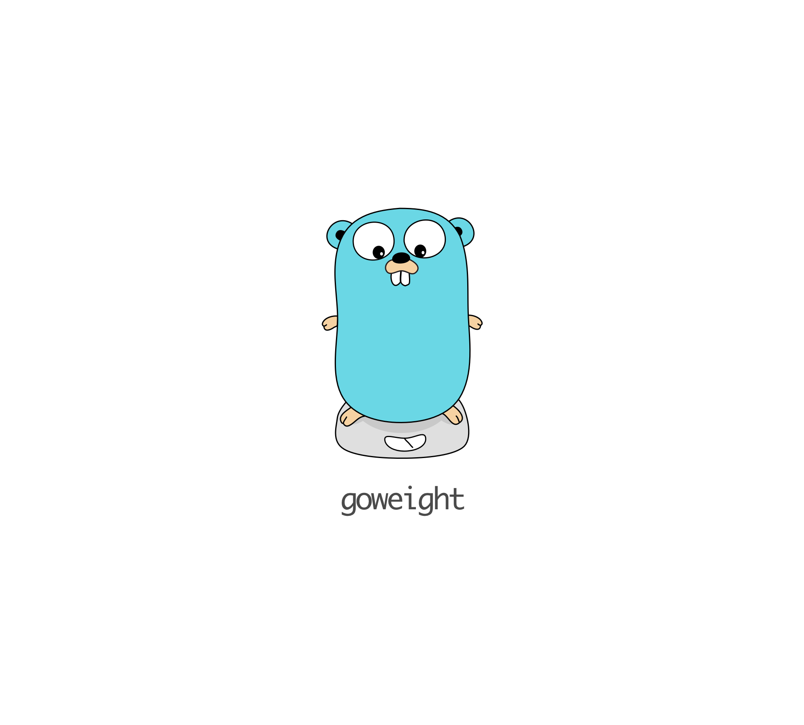

# goweight

A tool to analyze and troubleshoot a Go binary size.

For more, see [this blog post](https://medium.com/@jondot/a-story-of-a-fat-go-binary-20edc6549b97#.bzaq4nol0)

✅ Get a breakdown of all modules inside a binary  
✅ Supports Go 1.11 modules  
✅ Output as JSON for tracking and/or monitoring as part of CI  


## Quick Start

```
$ go get github.com/jondot/goweight
$ cd current-project
$ goweight
```

As an example, here's what `goweight` has to say about itself:

```
$ ./goweight
  3.0 MB runtime
  1.6 MB net
  1.4 MB reflect
  1.3 MB gopkg.in/alecthomas/kingpin.v2
  870 kB math/big
  668 kB github.com/alecthomas/template
  628 kB syscall
  626 kB text/template
  550 kB go/ast
  546 kB encoding/json
  509 kB text/template/parse
  495 kB github.com/alecthomas/template/parse
  424 kB time
  402 kB regexp/syntax
  395 kB golang_org/x/net/dns/dnsmessage
  388 kB fmt
```

### Thanks:

To all [Contributors](https://github.com/jondot/goweight/graphs/contributors) - you make this happen, thanks!

# Copyright

Copyright (c) 2018 [@jondot](http://twitter.com/jondot). See [LICENSE](LICENSE.txt) for further details.